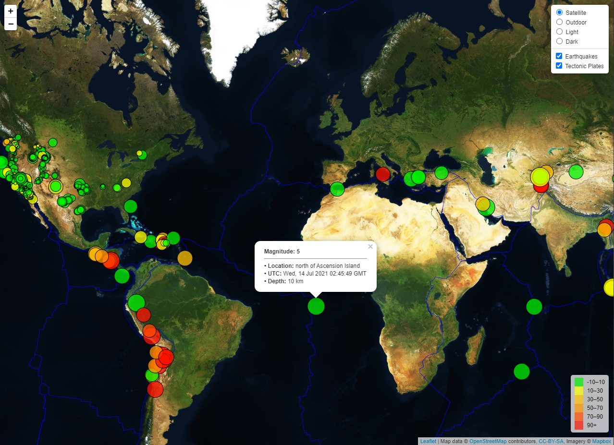

# H17_Leaflet-challenge
## Web App: Earthquake Data Visualization Map

### Description
The scope of this project is to showcase an interactive map to explore earthquake data from the United States Geological Survey (USGS). The data markers are plotted based on their longitude and latitude, marker size reflects the magnitude while color appears darker for earthquakes with greater depth (a map legend is included to provide context). Tooltip popups display magnitude, location, timestamp and depth values about each event when a marker is clicked. The dataset is called from the [USGS GeoJSON Feed](https://earthquake.usgs.gov/earthquakes/feed/v1.0/geojson.php).

### Script Summary
This web application was built using HTML & CSS for the webpage elements, JavaScript and D3 to load the dataset and Leaflet to render the interactive map.

### Features
1. Multiple base maps
2. Two data layers
3. Layer controls
4. Map legend
5. Tooltip popup
6. Data values determine marker size & color

### Screenshot

### [Explore the Eartquake Map!](https://rperezme-data.github.io/H17_Leaflet-challenge/Leaflet-Step-2/)
 

--- 

**Contact:** [rperezme.data@gmail.com](mailto:rperezme.data@gmail.com)